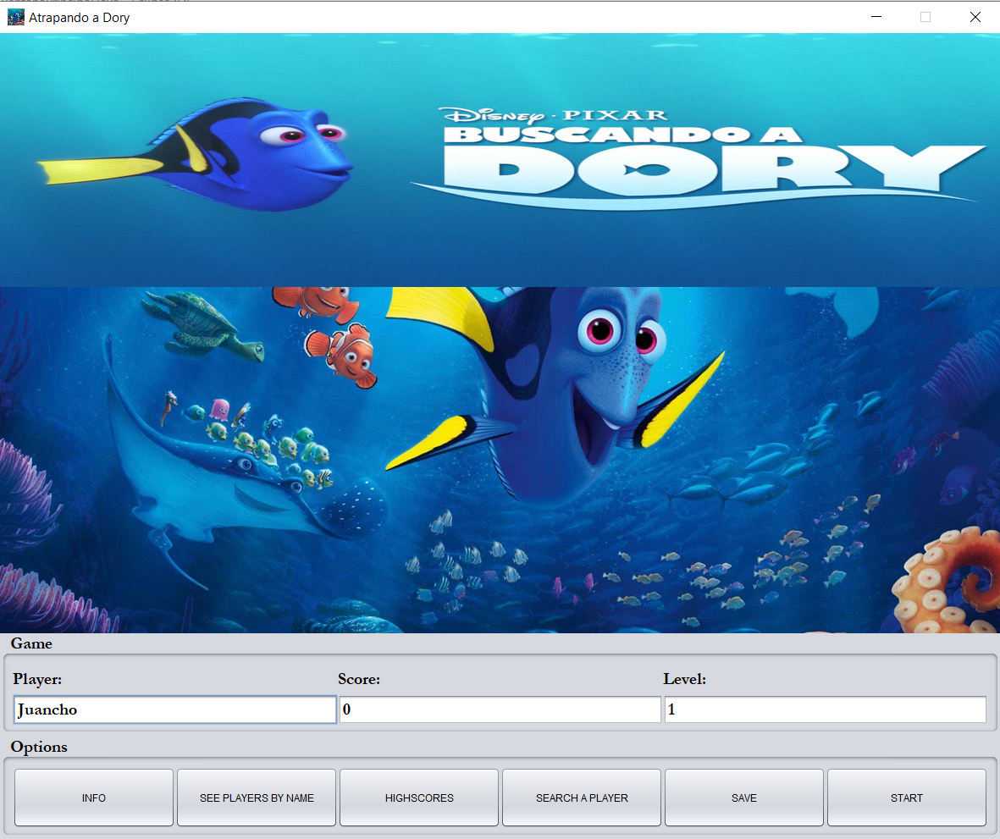
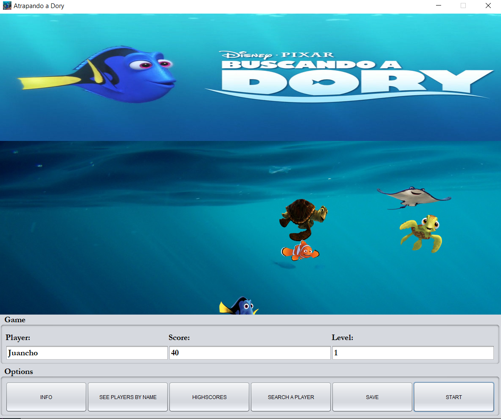

# Try to catch Dory

Try to catch Dory is a game where the player has to catch Dory clicking on her.

Some basic sorting algorithms as Selection, Insertion and Bubble were implemented and were used to sort players by score and by name. Also the binary search algorithm was  implemented.

